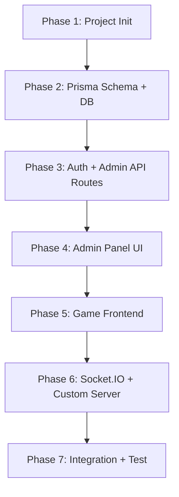

# Next.js Tabu Platformu: Implementation Plan

Mevcut iki projeyi (vanilla JS backend + React frontend tasarımı) tek bir Next.js 15 projesinde birleştiriyoruz. Proje mimarisi, ileride yeni oyunlar (Vampir Köylü vb.) ve yeni modlar ekleyebilecek şekilde **multi-game platform** olarak tasarlanacak.

## User Review Required

> [!IMPORTANT]
> **Socket.IO + Next.js**: Next.js'in varsayılan sunucusu Socket.IO'yu native desteklemez. Bunun için `custom server` (server.ts) kullanacağız. Bu, `next start` yerine `node server.ts` ile çalıştırma anlamına gelir. Production'da PM2 veya benzeri bir process manager kullanılacak.

> [!IMPORTANT]
> **Admin Auth**: Mevcut projede session-based admin auth var. Yeni projede **NextAuth.js** (Credentials provider) ile JWT-based admin authentication kullanacağız. Bu, admin paneli için daha güvenli ve modern bir çözüm.

> [!WARNING]
> **Gemini AI Servisi**: React tasarımındaki `geminiService.ts` (AI ile kart üretimi) **bu aşamada eklenmeyecek**. Mevcut veritabanı-tabanlı kelime havuzu sistemi korunacak. AI entegrasyonu ileride ayrı bir fazda eklenebilir.

---

## Proposed Changes

### 1. Project Initialization

#### [NEW] `newnextjs/` — Next.js 15 Project Skeleton

```
newnextjs/
├── docs/                         # Proje dokümantasyonları
│   ├── 01-architecture.md        # Mimari açıklama
│   ├── 02-database-schema.md     # Veritabanı şeması
│   ├── 03-socket-events.md       # Socket event referansı
│   └── 04-admin-panel.md         # Admin panel kullanım rehberi
│
├── prisma/
│   ├── schema.prisma             # Veritabanı modelleri
│   └── seed.ts                   # Başlangıç verileri
│
├── server.ts                     # Custom server (Express + Socket.IO + Next.js)
│
├── src/
│   ├── app/                      # Next.js App Router
│   │   ├── layout.tsx            # Root layout (theme provider, fonts)
│   │   ├── page.tsx              # Ana sayfa (giriş ekranı)
│   │   ├── globals.css           # Global stiller
│   │   │
│   │   ├── (game)/               # Oyun route grubu
│   │   │   └── room/
│   │   │       └── [code]/
│   │   │           └── page.tsx  # Lobi + Oyun sayfası
│   │   │
│   │   ├── admin/                # Admin panel route grubu
│   │   │   ├── layout.tsx        # Admin layout (sidebar, nav)
│   │   │   ├── page.tsx          # Dashboard
│   │   │   ├── words/
│   │   │   │   └── page.tsx      # Kelime yönetimi
│   │   │   ├── categories/
│   │   │   │   └── page.tsx      # Kategori yönetimi
│   │   │   ├── announcements/
│   │   │   │   └── page.tsx      # Duyuru yönetimi
│   │   │   └── bulk-upload/
│   │   │       └── page.tsx      # CSV toplu yükleme
│   │   │
│   │   └── api/                  # API Routes
│   │       ├── auth/[...nextauth]/
│   │       │   └── route.ts      # NextAuth handler
│   │       ├── admin/
│   │       │   ├── dashboard-stats/route.ts
│   │       │   ├── words/route.ts
│   │       │   ├── words/[id]/route.ts
│   │       │   ├── words/bulk-upload/route.ts
│   │       │   ├── categories/route.ts
│   │       │   ├── categories/[id]/route.ts
│   │       │   ├── categories/order/route.ts
│   │       │   ├── announcements/route.ts
│   │       │   └── announcements/[id]/route.ts
│   │       ├── announcements/visible/route.ts
│   │       └── health/route.ts
│   │
│   ├── components/
│   │   ├── ui/                   # shadcn/ui components
│   │   ├── game/                 # Tabu oyun bileşenleri
│   │   │   ├── game-card.tsx
│   │   │   ├── lobby.tsx
│   │   │   ├── sidebar.tsx
│   │   │   ├── scoreboard.tsx
│   │   │   ├── game-controls.tsx
│   │   │   ├── round-end-modal.tsx
│   │   │   ├── game-over-modal.tsx
│   │   │   ├── rules-modal.tsx
│   │   │   └── announcements-modal.tsx
│   │   ├── admin/                # Admin panel bileşenleri
│   │   │   ├── admin-sidebar.tsx
│   │   │   ├── stats-cards.tsx
│   │   │   ├── word-table.tsx
│   │   │   ├── word-form.tsx
│   │   │   ├── category-tree.tsx
│   │   │   ├── category-form.tsx
│   │   │   ├── announcement-list.tsx
│   │   │   ├── announcement-form.tsx
│   │   │   └── bulk-upload-form.tsx
│   │   ├── providers/
│   │   │   ├── theme-provider.tsx
│   │   │   └── socket-provider.tsx
│   │   └── shared/
│   │       └── logo.tsx
│   │
│   ├── hooks/
│   │   ├── use-socket.ts         # Socket.IO hook
│   │   └── use-game-state.ts     # Oyun durumu hook'u
│   │
│   ├── lib/
│   │   ├── prisma.ts             # Prisma client singleton
│   │   ├── auth.ts               # NextAuth config
│   │   ├── utils.ts              # shadcn/ui cn() utility
│   │   └── socket/
│   │       ├── game-socket.ts    # Socket.IO oyun mantığı (gameSocket.js portlanacak)
│   │       ├── word-service.ts   # Kelime havuzu servisi
│   │       └── category-service.ts # Kategori servisi
│   │
│   ├── types/
│   │   ├── game.ts               # Oyun tipleri
│   │   ├── admin.ts              # Admin tipleri
│   │   └── socket-events.ts      # Socket event tipleri
│   │
│   └── middleware.ts             # Next.js middleware (admin koruma)
│
├── .env.local                    # Ortam değişkenleri
├── next.config.ts
├── tailwind.config.ts
├── tsconfig.json
├── package.json
└── components.json               # shadcn/ui config
```

**Key Design Decisions:**

1. **Multi-Game Scalability**: `src/components/game/` altındaki bileşenler Tabu'ya özel. İleride `src/components/games/taboo/`, `src/components/games/werewolf/` gibi ayrılabilir. Route'lar `(game)/room/[code]` altında, ileride `(game)/taboo/[code]`, `(game)/werewolf/[code]` olabilir.

2. **Socket Mantığı**: `src/lib/socket/game-socket.ts` mevcut `gameSocket.js`'in TypeScript portu olacak. Tüm 900 satırlık mantık birebir korunacak.

3. **Admin Panel**: shadcn/ui ile modern, responsive admin paneli. Mevcut EJS template'leri React component'lere dönüşecek.

---

### 2. Database Schema (Prisma)

#### [NEW] [schema.prisma](file:///c:/Users/Erdal/Desktop/TABU%20PROJECT%2012.02.2026/newnextjs/prisma/schema.prisma)

Mevcut MySQL şeması Prisma modeline dönüştürülecek:

```prisma
model Admin {
  id        Int      @id @default(autoincrement())
  username  String   @unique @db.VarChar(50)
  password  String   @db.VarChar(255)
  createdAt DateTime @default(now()) @map("created_at")

  @@map("admins")
}

model Word {
  id         Int      @id @default(autoincrement())
  wordText   String   @unique @map("word_text") @db.VarChar(255)
  difficulty Int      @db.TinyInt // 1: Kolay, 2: Orta, 3: Zor

  tabooWords     TabooWord[]
  wordCategories WordCategory[]

  @@map("words")
}

model TabooWord {
  id           Int    @id @default(autoincrement())
  wordId       Int    @map("word_id")
  tabooWordText String @map("taboo_word_text") @db.VarChar(255)

  word Word @relation(fields: [wordId], references: [id], onDelete: Cascade)

  @@map("taboo_words")
}

model Category {
  id        Int     @id @default(autoincrement())
  name      String  @db.VarChar(255)
  parentId  Int?    @map("parent_id")
  color     String? @db.VarChar(7)
  sortOrder Int     @default(0) @map("sort_order")
  isVisible Boolean @default(true) @map("is_visible")

  parent   Category?  @relation("CategoryTree", fields: [parentId], references: [id], onDelete: SetNull)
  children Category[] @relation("CategoryTree")

  wordCategories WordCategory[]

  @@map("categories")
}

model WordCategory {
  wordId     Int @map("word_id")
  categoryId Int @map("category_id")

  word     Word     @relation(fields: [wordId], references: [id], onDelete: Cascade)
  category Category @relation(fields: [categoryId], references: [id], onDelete: Cascade)

  @@id([wordId, categoryId])
  @@map("word_categories")
}

model Announcement {
  id        Int      @id @default(autoincrement())
  title     String   @db.VarChar(255)
  content   String   @db.Text
  type      String   @default("guncelleme") @db.VarChar(20) // 'guncelleme' | 'duyuru'
  isVisible Boolean  @default(true) @map("is_visible")
  createdAt DateTime @default(now()) @map("created_at")

  @@map("announcements")
}
```

> [!NOTE]
> Mevcut veritabanı şeması birebir korunuyor. `@@map` ile tablo/kolon adları orijinal MySQL adlarıyla uyumlu tutulacak, böylece mevcut veriler direkt kullanılabilir.

---

### 3. Custom Server (Socket.IO Integration)

#### [NEW] [server.ts](file:///c:/Users/Erdal/Desktop/TABU%20PROJECT%2012.02.2026/newnextjs/server.ts)

```typescript
// Express + Socket.IO + Next.js custom server
// Mevcut server.js'in TypeScript portu
// Socket.IO gameSocket logic bu server üzerinden çalışacak
```

**Port edilen logicler:**
- `setupGameSocket(io)` → `src/lib/socket/game-socket.ts`
- `wordService` → `src/lib/socket/word-service.ts` (mysql2 yerine Prisma)
- `categoryService` → `src/lib/socket/category-service.ts` (mysql2 yerine Prisma)
- Rate limiting, graceful shutdown, health check

---

### 4. Admin Panel (shadcn/ui)

Mevcut EJS admin panelinin modern React versiyonu:

| Mevcut (EJS)         | Yeni (Next.js + shadcn/ui)          |
|----------------------|-------------------------------------|
| `dashboard.ejs`      | `src/app/admin/page.tsx`            |
| `words.ejs`          | `src/app/admin/words/page.tsx`      |
| `categories.ejs`     | `src/app/admin/categories/page.tsx` |
| `announcements.ejs`  | `src/app/admin/announcements/page.tsx` |
| `bulk-upload.ejs`    | `src/app/admin/bulk-upload/page.tsx`|
| `admin.ejs` (login)  | NextAuth login page                 |

Admin panel özellikleri:
- **Dashboard**: Canlı istatistikler (online kullanıcı, aktif lobi, kelime/kategori sayısı)
- **Kelime Yönetimi**: Arama, CRUD, zorluk seviyesi, kategori ataması, yasaklı kelimeler
- **Kategori Yönetimi**: Hiyerarşik ağaç, sürükle-bırak sıralama, renk atama, görünürlük
- **Duyuru Yönetimi**: Güncelleme/duyuru tipleri, Markdown desteği, görünürlük
- **Toplu Yükleme**: CSV dosyasından kelime ekleme

---

### 5. Game Frontend Components

React tasarımındaki bileşenler, socket.io bağlantısıyla birlikte Next.js'e taşınacak:

| React Tasarım              | Next.js Karşılığı                          | Değişiklikler                        |
|----------------------------|-------------------------------------------|--------------------------------------|
| `App.tsx` (LOGIN state)    | `src/app/page.tsx`                         | Socket.io `odaİsteği` entegrasyonu   |
| `App.tsx` (LOBBY state)    | `src/app/(game)/room/[code]/page.tsx`      | Gerçek socket verisi                 |
| `App.tsx` (PLAYING state)  | Aynı sayfa, state geçişi                   | Socket event'leri ile senkronize     |
| `Lobby.tsx`                | `src/components/game/lobby.tsx`            | Gerçek kategori API'si               |
| `Sidebar.tsx`              | `src/components/game/sidebar.tsx`          | shadcn/ui Button, Badge kullanımı    |
| `GameCard.tsx`             | `src/components/game/game-card.tsx`        | Korunacak, customCategoryColor       |
| `AnnouncementsModal.tsx`   | `src/components/game/announcements-modal.tsx` | API'den veri çekme                |

**Socket Event Mapping (mevcut event adları korunacak):**

| Event Adı                | Yön          | Açıklama                       |
|--------------------------|-------------|--------------------------------|
| `odaİsteği`              | Client→Server | Odaya katıl/oluştur           |
| `lobiGuncelle`           | Server→Client | Lobi verisi güncelleme        |
| `oyunBaslatİsteği`       | Client→Server | Oyunu başlat                  |
| `oyunBasladi`            | Server→Client | Oyun başladı bildirimi        |
| `oyunDurumuGuncelle`     | Server→Client | Durum güncelleme              |
| `turGecisiBaslat`        | Server→Client | Tur geçiş ekranı              |
| `yeniTurBilgisi`         | Server→Client | Rol ve kart bilgisi           |
| `oyunVerisi`             | Client→Server | Doğru/Tabu/Pas eylemi         |
| `kartGuncelle`           | Server→Client | Yeni kart gönder              |
| `oyunBitti`              | Server→Client | Oyun sonu                     |
| `takimDegistirİsteği`    | Client→Server | Takım değiştir                |
| `takimlariKaristir`      | Client→Server | Takımları karıştır            |
| `oyuncuyuAt`             | Client→Server | Oyuncu at (host)              |
| `yoneticiligiDevret`     | Client→Server | Yöneticilik devret            |
| `kategoriAyarlariGuncelle` | Client→Server | Kategori/zorluk güncelle   |
| `oyunKontrolİsteği`      | Client→Server | Durdur/devam                  |
| `oyunuSifirlaİsteği`     | Client→Server | Oyunu sıfırla                 |

---

### 6. Implementation Order

Projeyi aşağıdaki sırayla inşa edeceğiz:



**Her aşamada `docs/` klasörüne ilgili .md dosyası yazılacak.**

---

## Verification Plan

### Automated / Dev Server Tests

1. **Prisma Migration Test**
   ```bash
   cd newnextjs
   npx prisma db push
   npx prisma db seed
   ```
   Veritabanı tablolarının doğru oluştuğunu ve seed verisinin yüklendiğini doğrula.

2. **Dev Server Başlatma**
   ```bash
   npm run dev
   ```
   Localhost'ta sayfaların çalıştığını doğrula.

3. **Custom Server + Socket.IO Test**
   ```bash
   npx tsx server.ts
   ```
   Socket.IO bağlantısının kurulduğunu doğrula.

### Manual Verification (Browser)

1. **Admin Panel**: `http://localhost:3000/admin` → Login → Dashboard → Kelime ekle/düzenle/sil → Kategori ekle/düzenle → Duyuru ekle
2. **Oyun Akışı**: Ana sayfa → Kullanıcı adı gir → Oda oluştur → İkinci tarayıcı sekmesinde aynı oda koduna katıl → Takımları ayarla → Oyunu başlat → Tur geçişi → Skor → Oyun sonu
3. **Responsive**: Mobilde sidebar toggle, kart görünümü, lobi düzeni

> [!TIP]
> Socket.IO testleri için en az 2 tarayıcı sekmesi gerekecek. Oyunun 2v2 minimum gereksinimi olduğu için tam test 4 sekme (4 oyuncu) gerektirir.
